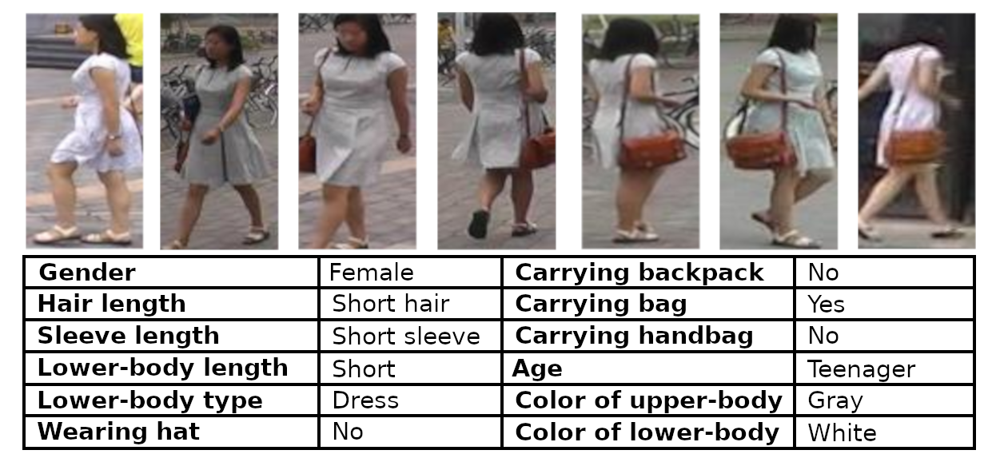
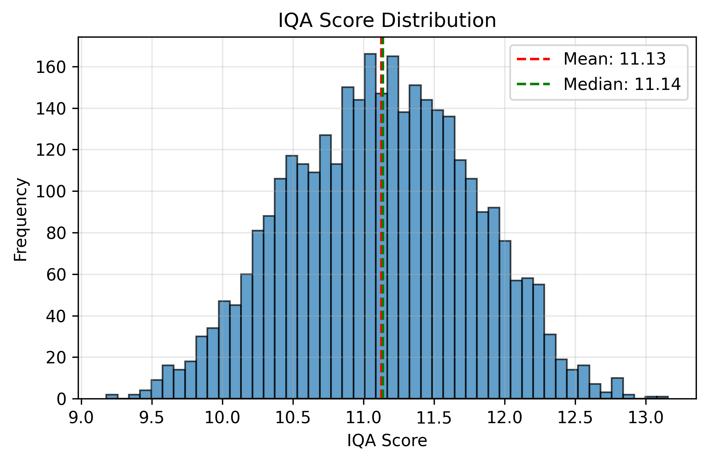
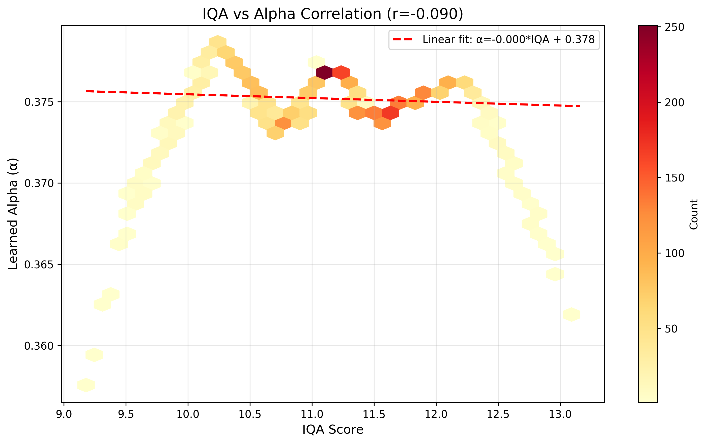
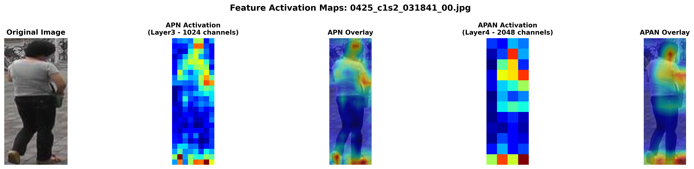
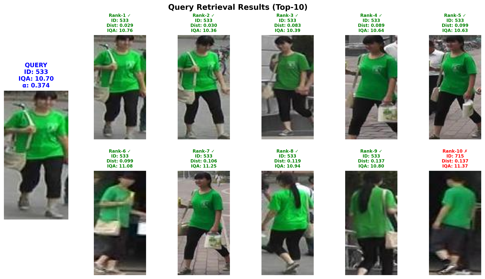
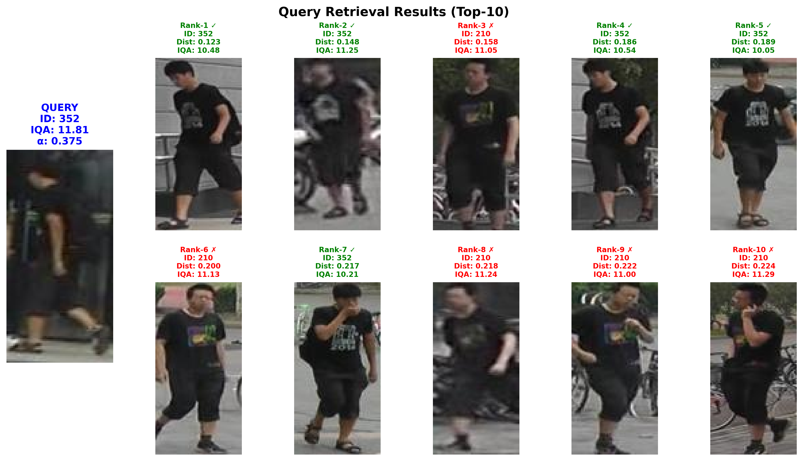
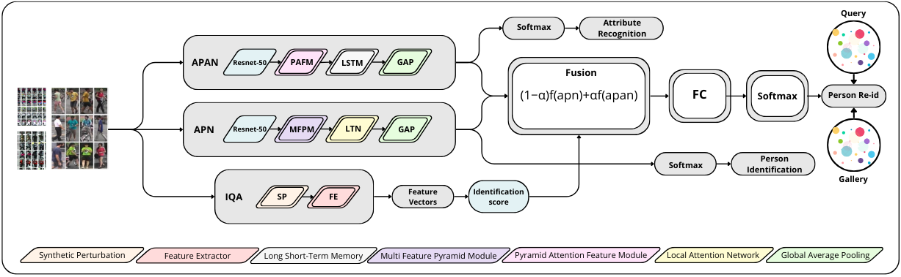
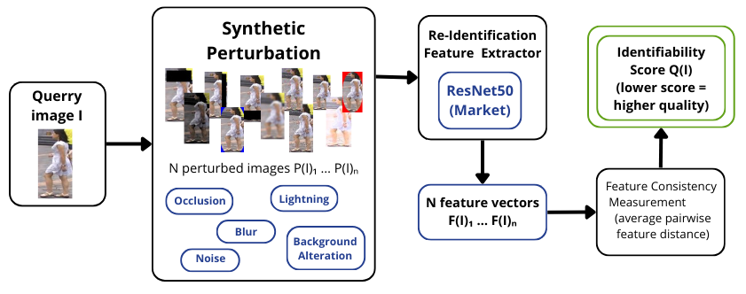
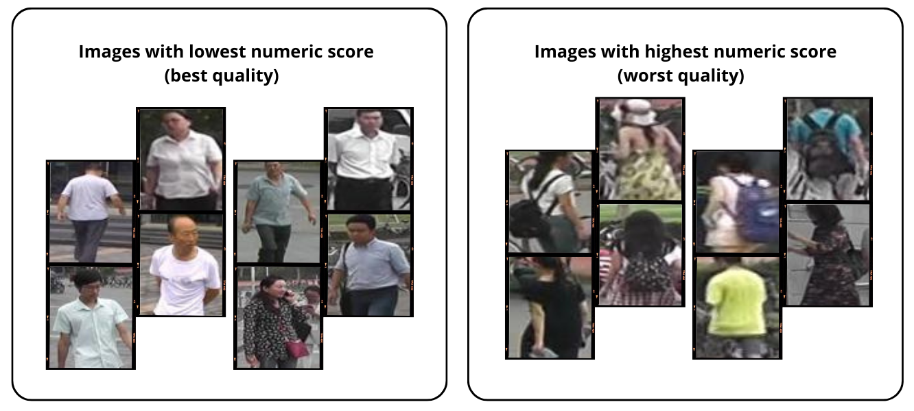

# Quality-Aware Person Re-Identification for Improved Fusion of Visual and Soft-Biometric Cues

## What is Person Re-Identification?

Imagine a network of security cameras spread across a train station. A person is spotted on camera A near the entrance. The question is: *where does this person appear on the other cameras?* This is the **Person Re-Identification (ReID)** problem - given a query image of a person taken by one camera, find all images of that same person across the rest of the camera network (the *gallery*).

This is harder than it sounds. The same person looks very different depending on the camera angle, lighting, distance, or whether they are partially occluded. Standard face recognition does not work here since faces are rarely visible at surveillance distances.

Two complementary strategies are used to represent a person:
- **Visual appearance** - global silhouette, clothing colors, body proportions. Fast and discriminative in good conditions, but brittle under blur or low resolution.
- **Soft biometric attributes** - high-level semantic cues such as gender, hair length, clothing type, or the presence of a backpack. More robust to image degradation because they describe *what* someone looks like rather than *exactly how* the pixels look.

**How does retrieval work?** The model encodes every image (query and gallery) into a compact numerical vector - a fixed-size descriptor that summarises the person's appearance. At query time, the query descriptor is compared against all gallery descriptors using Euclidean distance. The gallery images are then ranked from the closest (most similar) to the farthest. A correct retrieval means the same identity appears at the top of the ranked list.

<div align="center">

<br/>
<em>The same person captured from multiple camera viewpoints, alongside their associated soft biometric attributes (gender, clothing type, accessories…). These semantic descriptors remain consistent across viewpoints even when the visual appearance varies significantly.</em>
</div>

## This Project

This project implements **QAFM (Quality-Aware Fusion Model)**, a triple-branch deep learning architecture for person re-identification. The key idea is to make the fusion of visual and semantic features adaptive to the quality of each query image, rather than relying on a fixed weighting at inference time.

The system builds on the **Multi-Scale Pyramid Attention (MSPA)** framework and extends it with an unsupervised **Image Quality Assessment (IQA)** branch that computes an *identifiability score* - a model-centric measure of how stable a query's feature representation is under synthetic perturbations. This score drives a lightweight MLP that produces a per-query fusion weight $\alpha$, dynamically balancing the contributions of the visual and attribute branches.

## Key results on Market-1501

**Reading the metrics:**
- **Rank-1** - probability that the top-1 retrieved image belongs to the correct identity. This is the most intuitive metric.
- **Rank-5 / Rank-10** - probability that at least one correct match appears in the top 5 or top 10 results.
- **mAP (mean Average Precision)** - average precision across the full ranked list for all queries. More informative than Rank-1 alone when multiple correct images exist in the gallery.

For context, competitive methods on Market-1501 typically range from ~85–98% Rank-1 and ~70–98% mAP. QAFM sits in the upper tier of attribute-based methods, outperforming several recent baselines (e.g. LR-Net: 91.4% R1 / 79.6% mAP, HCM: 91.8% R1 / 79.0% mAP, UPR: 93.0% R1 / 82.4% mAP) while being the only approach among them to incorporate query-adaptive quality-aware fusion.

| Model | Rank-1 | Rank-5 | Rank-10 | mAP |
|-------|--------|--------|---------|-----|
| APN only (α=0) | 86.43 | 94.51 | - | 71.24 |
| APAN only (α=1) | 87.00 | 94.83 | - | 68.10 |
| Fixed α=0.4 | 92.70 | 97.45 | - | 81.91 |
| **QAFM (ours)** | **93.05** | **97.62** | **98.60** | **83.34** |

### Analysis

<div align="center">
<table><tr>
<td></td>
<td></td>
</tr></table>
<em>Left: identifiability scores on Market-1501 queries are concentrated around ~11.1, indicating limited variability across the dataset. Right: the learned fusion weight α collapses to a narrow range around 0.375, systematically favouring the APAN branch over the APN.</em>
</div>

<div align="center">

<br/>
<em>Correlation between the identifiability score Q(I) and the learned fusion weight α (r = −0.09). The near-flat relationship confirms that the current IQA signal acts more as a global mixing ratio than a strongly query-adaptive mechanism, due to the limited score variability on this benchmark.</em>
</div>

<div align="center">

<br/>
<em>Activation heatmap showing the regions that contribute most to the matching decision. Both branches focus on identity-relevant areas (upper torso, accessories, lower body) while suppressing background.</em>
</div>

<div align="center">
<table><tr>
<td></td>
<td></td>
</tr></table>
<em>Left: query ID 533 (α ≈ 0.374) - the correct identity dominates the top ranks despite moderate blur. Right: query ID 352 (α ≈ 0.375) - top-1 is correct but several distractors appear in the top-10 due to dark clothing similarity and motion blur.</em>
</div>

---

## Architecture

<div align="center">

<br/>
<em>The three-branch QAFM architecture: the APN (visual) and APAN (attribute) branches extract complementary identity descriptors, while the IQA branch computes an identifiability score that drives the dynamic fusion weight α.</em>
</div>

The model decomposes into three parallel streams:

### 1. Appearance Pyramid Network (APN)
Extracts a global visual descriptor $v_a$ from the ResNet-50 backbone using a **Multi-Feature Pyramid Module (MFPM)**: four parallel convolutional paths (one 1×1 and three dilated convolutions with rates 2, 3, 4) capture multi-scale context. A Local Attention Module (LAM) focuses on identity-relevant body regions. Output: a 1024-dimensional visual feature vector.

### 2. Attribute Pyramid Attention Network (APAN)
Extracts a semantic descriptor $v_s$ encoding **27 soft-biometric attributes** (gender, hair length, sleeve/lower-body length, clothing type, accessories, age, clothing colors). A **Pyramid Attention Feature Module (PAFM)** processes multi-scale features (3×3, 5×5, 7×7 paths), and a **ConvLSTM** models statistical dependencies between attributes (e.g., hair length ↔ gender). The branch uses 12 specialized prediction heads grouped by semantic similarity. Output: a 1024-dimensional attribute feature vector.

### 3. IQA Branch

<div align="center">

<br/>
<em>The IQA branch: a pretrained ResNet-50 encodes the original image and 34 perturbed variants; the mean pairwise distance between all feature vectors yields the identifiability score Q(I).</em>
</div>

Given a query image $I$, 34 perturbed variants are generated, covering:
- **Lighting shifts** - HSV V-channel offsets {−90, −45, +45, +90}
- **Gaussian blur** - σ ∈ {1, 1.5, 1.85}
- **Occlusions** - black rectangles on each border (4 sizes × 4 sides = 16 variants)
- **Background changes** - oval mask with uniform colors (2 scales × 4 colors = 8 variants)
- **Noise** - Gaussian, salt-and-pepper, speckle

The identifiability score is the mean pairwise Euclidean distance across the 35 resulting feature vectors (original + 34 perturbations):

$$Q(I) = \frac{2}{N(N-1)} \sum_{i < j} d(F(I)_i, F(I)_j), \quad N \ge 35$$

A lightweight MLP (1→32→1 + Sigmoid) maps $Q(I)$ to $\alpha \in [0,1]$.

<div align="center">

<br/>
<em>Examples of images with the best (low Q - stable features, high quality) and worst (high Q - unstable features, ambiguous/degraded) identifiability scores on Market-1501.</em>
</div>

### Dynamic Fusion
$$V_{\text{final}} = \bigl[\,\alpha \cdot v_a,\; (1-\alpha) \cdot v_s\,\bigr]$$

High $\alpha$ → trust visual APN (high-quality image). Low $\alpha$ → trust semantic APAN (degraded image). The fused 2048-dim descriptor is projected to 1000 dimensions by a final FC layer.

## Installation

**Requirements:** Python ≥ 3.12, CUDA-capable GPU recommended.

```bash
# Clone the repository
git clone <repo-url>
cd reid-soft-attributes

# Install dependencies with uv
uv sync
```

---

## Usage

All configuration is centralised in `config.yaml`. Edit it to adjust paths, batch sizes, learning rates, and perturbation parameters.

### Training

```bash
uv run python main.py --mode train
```

Training follows a **two-stage strategy**:

1. **Stage 1** - APAN branch trained independently to stabilise attribute representations (the 12 prediction heads converge on the 27 soft-biometric labels).
2. **Stage 2** - Full end-to-end fine-tuning: APN, APAN, IQA MLP, and fusion FC are jointly optimised with four independent backward passes per mini-batch.

Key hyperparameters (from `config.yaml`):

| Parameter | Value |
|-----------|-------|
| Image size | 384 × 128 |
| Batch size (train) | 32 |
| Optimizer | Adam, lr = 3.5×10⁻⁴ |
| LR schedule | Linear warmup (10 epochs) + cosine annealing, 120 epochs total |
| Losses | Label-smoothed cross-entropy (ε=0.1), BCEWithLogitsLoss, Triplet (margin 0.3) |

### Evaluation

Evaluation is run automatically at the end of each epoch during training. There is no separate evaluation mode - simply run `main.py` and the final Rank-1, Rank-5, Rank-10, and mAP scores are logged at the end of training.

### IQA Score Pre-computation

Identifiability scores are computed automatically at the start of each run for the train, gallery, and query splits, then cached to disk to avoid recomputation on subsequent runs. The cache path is controlled by `iqa.cache_path` in `config.yaml` (default: `iqa_cache.npy`).

---

## Dependencies

| Package | Version |
|---------|---------|
| Python | ≥ 3.12 |
| PyTorch | ≥ 2.10.0 |
| torchvision | ≥ 0.25.0 |
| numpy | ≥ 2.4.2 |
| opencv-python | ≥ 4.13 |
| scipy | ≥ 1.17 |
| tensorboard | ≥ 2.20 |
| ruff | ≥ 0.15 |

Full list in `pyproject.toml`.

---

## Report

A full research paper detailing this project is available in the [`report/`](report/) folder. It covers in depth:

- Related work and state-of-the-art comparison
- Formal problem formulation and full architectural description (APN, APAN, IQA branch)
- Dataset, preprocessing, and data augmentation details
- Two-stage training strategy and all loss functions
- Experimental results, ablation study, and qualitative analysis

---

## References

1. S. U. Khan et al., *"Visual Appearance and Soft Biometrics Fusion for Person Re-Identification Using Deep Learning"*, IEEE JSTSP, 2023. - **MSPA / APN / APAN**
2. H. Chen, E. J. Delp, A. R. Reibman, *"Estimating Image Quality for Person Re-Identification"*, IEEE MMSP, 2021. - **IQA / Identifiability**
3. Y. Lin et al., *"Improving Person Re-identification by Attribute and Identity Learning"*, Pattern Recognition, 2019. - **Market-1501 attribute annotations**
4. L. Zheng et al., *"Scalable Person Re-identification: A Benchmark"*, ICCV, 2015. - **Market-1501 dataset**
5. K. He et al., *"Deep Residual Learning for Image Recognition"*, CVPR, 2016. - **ResNet-50 backbone**
6. B. Luo et al., *"Bag of Tricks and A Strong Baseline for Deep Person Re-identification"*, CVPRW, 2019. - **Training strategy**
